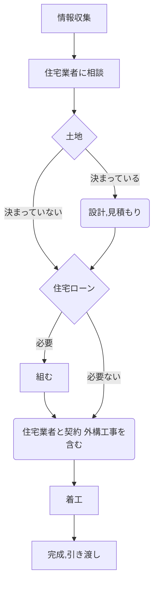

# 「家」をつくる人と「庭・外構」を作る人

- 住まい作りというのは、「それぞれ専門の業者が集まって1つの住まいを作る」ということ
- ハウスメーカーの大工さんが作るのではなく、ハウスメーカーの下請けさんや依頼を受けた業者が作る

## 住まいづくりに関わる人達を知っておく

- 住まいづくりのステークホルダーを把握しておく

<dl>
  <dt>不動産業者</dt>
  <dd>土地を探す</dd>
  <dt>設計業者</dt>
  <dd>建物を設計し、設計図を書く</dd>
  <dt>基礎工事業者</dt>
  <dd>建物の基礎を作る</dd>
  <dt>建築業者</dt>
  <dd>建物全体を作る（仕切壁、建具、壁紙、床面、天井等）</dd>
  <dt>電気、管工事業者</dt>
  <dd>電気、水道、ガスなどインフラを作る</dd>
  <dt>外構業者</dt>
  <dd>塀や門、駐車スペースなどの外構を作る</dd>
  <dt>金融機関</dt>
  <dd>住宅ローンを借りる</dd>
  <dt>司法書士</dt>
  <dd>不動産登記などを行う</dd>
  <dt>住宅業者（ハウスメーカー、工務店）</dt>
  <dd>家を販売する、家づくりが計画通りに進んでいるか管理する</dd>
</dl>

- ハウスメーカーに任せる部分は任せ、自分の意見はしっかり伝える

## ハウスメーカーと工務店

- 両者の違いに明確な定義はない

<dl>
  <dt>ハウスメーカー</dt>
  <dd>
    <ul>
      <li>独自の施工法を持っていて、別会社を通して家を販売する</li>
      <li>実際の施工は下請け業者が行う</li>
      <li>土地探しについては、自社の不動産部門や提携している不動産会社を通して物件を探してくれる</li>
      <li>コスト面では、独自工法の開発経費や宣伝広告費、人件費などの費用がかかっているため、建物価格は工務店より高くなりがち</li>
      <li>社員教育は販売接客マニュアルなどがあり、親切な対応をしてくれる</li>
      <li>全国に同様の施工事例をたくさん持っている</li>
      <li>工期が短くて済むケースが多い</li>
      <li>無料の修理期間や定期点検サービスなどのメンテナンス制度が整えられている</li>
    </ul>
  </dd>
  <dt>工務店</dt>
  <dd>
    <ul>
      <li>地元の中小企業である場合が多い</li>
      <li>自ら企画設計し、自社の社員（職人）が直接施工する</li>
      <li>地域密着型経営である場合が多く、自由道は高いはず</li>
      <li>困ったときにすぐに駆けつけてくれるかも</li>
      <li>一度に施工できる物件数に限りがあるので、繁忙期は着工まで待たされることがある</li>
      <li>ときにフランクとも見える対応に戸惑う人もいる</li>
    </ul>
  </dd>
</dl>

- どちらにも一長一短ある
- すべてを任せたいならハウスメーカー、自分の意見にこだわった住まいをつくりたいなら工務店、ということになりそう
- 建築設計事務所の建築士と家造りをする方法もある

## エクステリア業者、外構業者、造園業者

- 住宅業者に建物も外構もすべて任せてしまうのは、悩ましい
- 建物は洒落ているのに外構が残念、ということが起きがち
- 建物だけで予算を使い果たしてしまった場合に起きがち

## 住まいづくりの流れを知っておこう

- 事前計画がとにかく大事
- 工事が始まってからではどうしようもなかったり、お金がかかったりする
- 何も知らなければ質問さえできない
- 外構をエクステリア業者に相談する場合は、住宅業者に相談する時点でその旨を伝える必要がある
- 着工のあと、工事途中の段階で費用の一部を業者に支払わなければならないケースも多くある
- 住宅ローンを申し込む時点で「つなぎ融資」も合わせて申し込んでおく

## 知っておくべき住まいづくり用語

### 建物に関する用語

<dl>
  <dt>建ぺい率</dt>
  <dd>敷地面積に対して建築できる面積の比率。地域によって決まっている。</dd>
  <dt>基礎工事</dt>
  <dd>建築物を支え、安定させるための建物の最下部に作る構造物。</dd>
  <dt>小屋裏</dt>
  <dd>最上階の天井と屋根裏の間にできる空間。居住スペースとしては使用できないが、はしご階段を使い収納スペースなどに活用できる。</dd>
  <dt>開口部</dt>
  <dd>窓や玄関など、建物に設けられた出入り口のこと。採光や通風、換気のための小さな窓や屋根の天窓なども含まれる。</dd>
  <dt>ユーティリティスペース</dt>
  <dd>広さを必要とした家事をするためのスペース。一般的にはキッチンや洗面所に隣接した場所に作る。</dd>
  <dt>スキップフロア</dt>
  <dd>建物の床面の一部に高さを変えた部分をもたせた仕様のこと。住宅の一部が地下になっていたり、車庫を一階に組み込んだ場合、また敷地が傾斜している場合などにも、床の高さを半階ずつずらした空間を作り活用できる。</dd>
</dl>

### 外構に関する用語

<dl>
  <dt>敷地境界</dt>
  <dd>道路や隣地との境界線。一般的にはコンクリート杭等でその位置を示してある。その杭得意を結んだのが敷地境界。後のトラブルを避けるためにも、ブロックやフェンス等で敷地所有者を明確にしておくのが通例。</dd>
  <dt>クローズ外構</dt>
  <dd>建物とその周辺を塀で囲む閉鎖的な外構のこと。もんや車庫なども含め、住宅と一体感をもたせた高級感があるデザインが可能でセキュリティーやプライバシーも守られる。</dd>
  <dt>オープン外構</dt>
  <dd>門などはなく車庫から玄関までをオープンにする外構のこと。開放的で、クローズ外構に比べ安価なデザインが可能。セキュリティーやプライバシーは希薄になる。</dd>
  <dt>エクステリアプランナー</dt>
  <dd>資格認定試験を通して認定された、エクステリアの設計や工事管理に従事する人。</dd>
  <dt>アプローチ</dt>
  <dd>道路から玄関ポーチまでの専用通路。</dd>
  <dt>配管・桝</dt>
  <dd>雨水、汚水、ガスなどの供給処理のために地下に埋められる管のこと。後の外構工事に深く関わってくるので、建物着工前の外構計画が重要。</dd>
  <dt>外構分離発注</dt>
  <dd>外構工事を建物の施工業者と分けて、施主が直接エクステリア専門業者と契約をすること。地域によっては外構分離発注が通例になっている。</dd>
</dl>

## 住宅情報誌の目的を知っておこう

- 住宅情報誌は住宅業者のPR誌であるということを頭に入れておく
- たくさんの住宅業者の情報が一度にわかるし、近所で見かけない会社や聞いたことのない住宅業者の情報がわかる
- ファッション雑誌を読むような間隔で読む
  - 住宅情報誌に出ている住まいをそのまま自分の住まいとして作っても、住む人の生活スタイルは違うので、どんなに美しく見えても使いづらくなってしまう
- 住宅情報誌は学ぶための本というより、楽しむための本

## ネット情報の落とし穴をしっておこう

- ネットで見積もれる額は、あくまで参考程度
  - 本来、住まいづくりの見積もりとは、現場を見た上で綿密な打ち合わせをしてから出すもの
- 「ネット見積もりの額で工事しろ！」みたいに圧を欠けると、品質を落とされることになるので、しない
  - ネット見積もりに限らず、工事の途中で計画が変わったり、住宅業者の責任で見積額に違いがあった場合に、追加料金を請求されることがある
  - （住宅業者が悪い場合の）追加料金に対して、「だめ！元の料金で！」とすると、材料や仕様などの目に見えないところで品質を落として帳尻を合わせるような対応をされる場合がある
- ネットの情報は一方通行になりがち
  - わからないことがあった場合、分かったふりをせず、直接話して質問するなどする

## 「売る人」、「つくる人」、「住む人」

- 任せっぱなしは良くない
- 住宅業者は利益を追求するので、利益率の高いものをすすめてくる（しかたない）
- 建物を予算ギリギリまでゴツくされて、外構がしょぼくなる、みたいなことありがち

## 土地探しの憂鬱
