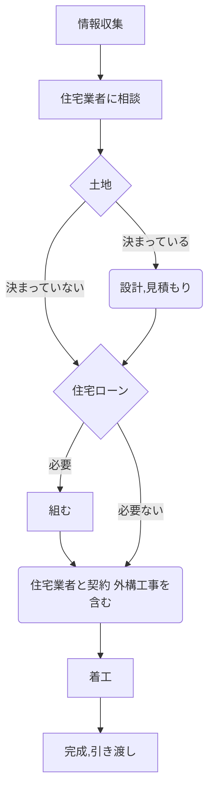

# 「家」をつくる人と「庭・外構」を作る人

- 住まい作りというのは、「それぞれ専門の業者が集まって1つの住まいを作る」ということ
- ハウスメーカーの大工さんが作るのではなく、ハウスメーカーの下請けさんや依頼を受けた業者が作る

## 住まいづくりに関わる人達を知っておく

- 住まいづくりのステークホルダーを把握しておく

<dl>
  <dt>不動産業者</dt>
  <dd>土地を探す</dd>
  <dt>設計業者</dt>
  <dd>建物を設計し、設計図を書く</dd>
  <dt>基礎工事業者</dt>
  <dd>建物の基礎を作る</dd>
  <dt>建築業者</dt>
  <dd>建物全体を作る（仕切壁、建具、壁紙、床面、天井等）</dd>
  <dt>電気、管工事業者</dt>
  <dd>電気、水道、ガスなどインフラを作る</dd>
  <dt>外構業者</dt>
  <dd>塀や門、駐車スペースなどの外構を作る</dd>
  <dt>金融機関</dt>
  <dd>住宅ローンを借りる</dd>
  <dt>司法書士</dt>
  <dd>不動産登記などを行う</dd>
  <dt>住宅業者（ハウスメーカー、工務店）</dt>
  <dd>家を販売する、家づくりが計画通りに進んでいるか管理する</dd>
</dl>

- ハウスメーカーに任せる部分は任せ、自分の意見はしっかり伝える

## ハウスメーカーと工務店

- 両者の違いに明確な定義はない

<dl>
  <dt>ハウスメーカー</dt>
  <dd>
    <ul>
      <li>独自の施工法を持っていて、別会社を通して家を販売する</li>
      <li>実際の施工は下請け業者が行う</li>
      <li>土地探しについては、自社の不動産部門や提携している不動産会社を通して物件を探してくれる</li>
      <li>コスト面では、独自国宝の開発経費や宣伝広告費、人件費などの費用がかかっているため、建物価格は工務店より高くなりがち</li>
      <li>社員教育は販売接客マニュアルなどがあり、親切な対応をしてくれる</li>
      <li>全国に同様の施工事例をたくさん持っている</li>
      <li>工期が短くて住むケースが多い</li>
      <li>無料の修理期間や定期点検サービスなどのメンテナンス制度が整えられている</li>
    </ul>
  </dd>
  <dt>工務店</dt>
  <dd>
    <ul>
      <li>地元の中小企業である場合が多い</li>
      <li>自ら企画設計し、自社の社員（職人）が直接施工する</li>
      <li>地域密着型経営である場合が多く、自由道は高いはず</li>
      <li>困ったときにすぐに駆けつけてくれるかも</li>
      <li>一度に施工できる物件数に限りがあるので、繁忙期は着工まで待たされることがある</li>
      <li>ときにフランクとも見える対応に戸惑う人もいる</li>
    </ul>
  </dd>
</dl>

- どちらにも一長一短ある
- すべてを任せたいならハウスメーカー、自分の意見にこだわった住まいをつくりたいなら工務店、ということになりそう
- 建築設計事務所の建築士と家造りをする方法もある

## エクステリア業者、外構業者、造園業者

- 住宅業者に建物も外構もすべて任せてしまうのは、悩ましい
- 建物は洒落ているのに外構が残念、ということが起きがち
- 建物だけで予算を使い果たしてしまった場合に起きがち

## 住まいづくりの流れを知っておこう

- 事前計画がとにかく大事
- 工事が始まってからではどうしようもなかったり、お金がかかったりする
- 何も知らなければ質問さえできない
- 外構をエクステリア業者に相談する場合は、住宅業者に相談する時点でその旨を伝える必要がある
- 着工のあと、工事途中の段階で費用の一部を業者に支払わなければならないケースも多くある
- 住宅ローンを申し込む時点で「つなぎ融資」も合わせて申し込んでおく

## 知っておくべき住まいづくり用語

## 住宅情報誌の目的を知っておこう

## ネット情報の落とし穴をしっておこう

## 「売る人」、「つくる人」、「住む人」

## 土地探しの憂鬱
